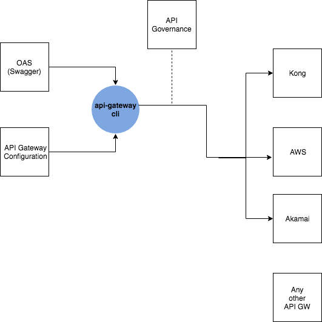

# API GATEWAY CLI

The API Gateway CLI Toolbelt is a vendor agnostic tool that manage, provision any API Gateway platform including Kong, AWS API GW and Akamai.

The main motivations behind building such a tool are :

- Support of your API First lifecycle
- Reduce [LockInCost](https://martinfowler.com/bliki/LockInCost.html) to zero
- Build your own API Gateway Governance model




## Setup


## Supported providers

- [x] Kong (Ingress)
- [ ] Kong
- [ ] AWS API Gateway
- [ ] Akamai 

## Get started (Kong Ingress)

### Step.1

Write your OAS spec ([example](./swagger.yaml))

### Step.2 

Define your API Gateway configuration

```
namespace: mobile
basepath: / #retrieve from swagger
connect_timeout: 10000
read_timeout: 5000
write_timeout: 6000
retries: 3
protocols: #retrieve from swagger
  - http
  - https
methods: #retrieve from swagger
  - POST
  - GET
host: mobile.api.3stripes.io
upstream_host: test
upstream_port: 8001
```

** This configuration will change in the next release, as the goal is to build an agnostic configuration **

### Step.3

Generate the [`kong ingress`](https://github.com/Kong/kubernetes-ingress-controller) manifests

```
api-gateway generate --spec="./swagger.yaml" --config="./blueprint-prod.yaml"
```

Will generate 

```
apiVersion: configuration.konghq.com/v1
kind: KongIngress
metadata:
  name: checkout
  namespace: mobile
proxy:
  path: /
  connect_timeout: 10000
  retries: 3
  read_timeout: 5000
  write_timeout: 6000
route:
  protocols:
    - http
    - https
  methods:
    - POST
    - GET
  strip_path: false
  preserve_host: true
---
apiVersion: extensions/v1beta1
kind: Ingress
metadata:
  name: checkout-ingress
  namespace: mobile
  annotations:
    kubernetes.io/ingress.class: "kong"
spec:
  rules:
  - host: mobile.api.3stripes.io
    http:
      paths:
      - path: /orders/[a-zA-Z0-9_-]+
        backend:
          serviceName: test
          servicePort: 8001

      - path: /
        backend:
          serviceName: test
          servicePort: 8001

      - path: /orders
        backend:
          serviceName: test
          servicePort: 8001
```


## Roadmap
- [ ] Agnostic blueprint configuration
- [ ] Granular endpoints configuration
- [ ] Applications / API Keys provisioning
- [ ] Rate-limit support
- [ ] Authentication/Authz support
- [ ] API Gateway enterprise governance
- [ ] Support AWS API Gateway
- [ ] Support Akamai API Gateway